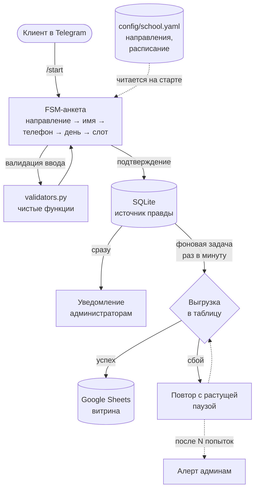

# 🎵 Telegram-бот записи на пробное занятие

[](https://github.com/enrive2020/music-school-telegram-bot/actions/workflows/tests.yml)
[](https://www.python.org/)
[](https://docs.aiogram.dev/)

Бот приёма заявок для музыкальной школы: клиент выбирает направление,
оставляет контакты и записывается на конкретный слот времени. Заявка
сохраняется локально, уезжает в Google Sheets и приходит администраторам
в Telegram.

Готов к использованию как есть — под другую школу настраивается одним
YAML-файлом, без правки кода.

---

## Что умеет

- **Каталог направлений из конфига** — названия, цены, описания правит
  владелец, программист не нужен
- **Запись на конкретное время** — выбор дня и слота кнопками, сетка
  строится из расписания школы
- **Валидация ввода** — телефон приводится к единому формату, имя
  проверяется по белому списку символов, мусор не проходит
- **Заявка не теряется** — сохраняется до любых внешних вызовов;
  недоступность Google не мешает приёму
- **Уведомления администраторам** — новая заявка приходит в общий чат
  с кликабельным телефоном
- **Админ-команды** — `/stats` и `/orders` прямо в Telegram
- **Работает 24/7** — Docker с автоперезапуском

---

## Как устроено



**Ключевое решение — SQLite как источник правды, Google Sheets как
витрина.** Заявка пишется на диск до всяких сетевых вызовов, поэтому
недоступность Google, обрыв связи или перезапуск бота не могут привести
к её потере. Фоновая задача досылает накопленное, когда сервис вернётся.

Второе важное разделение: **YAML описывает шаблон** («какие слоты бывают
в принципе»), **база хранит состояние** («этот вторник занят»). По этому
шву достраивается проверка занятости без переписывания диалога.

---

## Стек

| Технология | Зачем |
|---|---|
| Python 3.12 | Базовый язык |
| aiogram 3 | Асинхронный фреймворк для Telegram: FSM, роутеры, DI |
| pydantic | Типизированные модели: конфиг и настройки проверяются на старте |
| aiosqlite | Асинхронный SQLite — не блокирует обработку других диалогов |
| gspread | Работа с Google Sheets |
| phonenumbers | Разбор телефонов (порт Google libphonenumber) |
| pytest | 176 тестов, включая диалог целиком |
| Docker | Развёртывание одной командой |

---

## Быстрый старт

### 1. Установка

```bash
git clone https://github.com/enrive2020/music-school-telegram-bot.git
cd music-school-telegram-bot

python -m venv .venv
.venv\Scripts\activate        # Windows
source .venv/bin/activate     # Linux/macOS

pip install -r requirements.txt
```

### 2. Настройка

```bash
cp .env.example .env
```

Заполнить `.env`:

| Переменная | Где взять | Обязательно |
|---|---|---|
| `BOT_TOKEN` | [@BotFather](https://t.me/BotFather) → `/newbot` | да |
| `ADMIN_CHAT_ID` | добавить бота в чат, отправить `/chatid` | нет¹ |
| `GOOGLE_SHEET_ID` | кусок URL таблицы между `/d/` и `/edit` | нет¹ |
| `GOOGLE_CREDENTIALS_FILE` | JSON-ключ сервисного аккаунта → `secrets/` | нет¹ |

¹ Без них бот работает, просто без уведомлений или без выгрузки в таблицу.

<details>
<summary><b>Как получить доступ к Google Sheets</b></summary>

1. [console.cloud.google.com](https://console.cloud.google.com) → создать проект
2. **API и сервисы → Библиотека** → включить **Google Sheets API** и **Google Drive API**
3. **Учётные данные → Создать → Сервисный аккаунт** (роль не нужна)
4. Открыть созданный аккаунт → **Ключи → Добавить ключ → JSON** → скачать
5. Положить файл в `secrets/google-credentials.json`
6. Скопировать `client_email` из этого файла
7. Открыть свою Google-таблицу → **Поделиться** → вставить этот email → права **Редактор**

Проверить доступ:
```bash
python -m scripts.check_sheets
```
</details>

### 3. Запуск

```bash
python -m bot.main
```

Проверить, что всё настроено:
```bash
python -m scripts.healthcheck
```

---

## Настройка под свою школу

Всё в [`config/school.yaml`](config/school.yaml) — код трогать не нужно.

```yaml
school:
  name: "Школа музыки «Аккорд»"
  timezone: "Europe/Moscow"
  phone_region: "RU"          # для номеров без кода страны

  schedule:
    slot_minutes: 60          # шаг сетки времени
    booking_horizon_days: 14  # на сколько дней вперёд открыта запись
    booking_buffer_hours: 2   # за сколько часов закрывать запись на сегодня
    week:
      mon: ["12:00-20:00"]
      sat: ["10:00-14:00", "15:00-18:00"]   # перерыв на обед
      # день не указан → выходной

directions:
  - id: guitar                # латиницей, менять нельзя после запуска
    title: "Гитара"
    emoji: "🎸"
    description: "Акустическая и электрогитара с нуля."
    price_per_lesson: 1200
    lesson_minutes: 60
```

Опечатка в конфиге не доедет до клиента: бот откажется стартовать
и укажет, что именно не так.

---

## Развёртывание

### Docker (рекомендуется)

```bash
docker compose up -d          # запустить
docker compose logs -f        # смотреть логи
docker compose restart        # перезапустить
docker compose down           # остановить
```

Контейнер поднимается сам после сбоя и после перезагрузки сервера.
База, логи, конфиг и ключи подключены с хоста — обновление образа
их не затрагивает.

<details>
<summary><b>Развёртывание на VPS</b></summary>

Подойдёт любой сервер с 1 ГБ памяти (~200 ₽/мес).

```bash
# на сервере: поставить Docker
curl -fsSL https://get.docker.com | sh

# забрать код
git clone https://github.com/enrive2020/music-school-telegram-bot.git
cd music-school-telegram-bot

# перенести секреты с локальной машины (выполнять У СЕБЯ)
scp .env user@server:~/music-school-telegram-bot/
scp secrets/google-credentials.json user@server:~/music-school-telegram-bot/secrets/

# запустить
docker compose up -d
docker compose logs -f
```

Обновление до новой версии:
```bash
git pull && docker compose up -d --build
```

Резервная копия заявок:
```bash
cp data/orders.db backup-$(date +%F).db
```
</details>

---

## Тесты

```bash
pip install -r requirements-dev.txt
pytest
```

176 тестов, полный прогон около 6 секунд. Покрыты валидаторы, конфиг,
расписание, хранилище, форматтеры и сам диалог — с настоящими роутерами
и FSM, подменён только транспорт к Telegram.

Набор проверен мутационно: в код вносились реальные дефекты, все были
пойманы.

---

## Структура

```
bot/
├── main.py            точка входа: сборка и запуск
├── settings.py        переменные окружения (pydantic)
├── catalog.py         модели конфига: направления, расписание
├── validators.py      проверка ввода — чистые функции без Telegram
├── formatters.py      форматирование дат и времени
├── filters.py         контроль доступа к админ-командам
├── handlers/          обработчики диалога
├── keyboards/         клавиатуры и callback-фабрики
├── states/            состояния FSM
├── services/          расписание, уведомления, Google Sheets
└── storage/           модели заявок и репозиторий (единственное место с SQL)

config/school.yaml     настройка под конкретную школу
scripts/               утилиты: диагностика, просмотр заявок
tests/                 176 тестов
docs/                  проектные решения с разбором альтернатив
```

---

## Что дальше

Заложено в архитектуре, но не реализовано:

- **Занятость слотов** — сервис расписания единственная точка генерации,
  вычитание занятых встанет туда без правки обработчиков
- **Напоминания клиентам** — фоновый воркер уже есть
- **Замена Sheets на CRM** — хранилище за интерфейсом репозитория
- **Расписание на каждое направление** — модель готова

---

## Документация решений

[`docs/design-name-and-slots.md`](docs/design-name-and-slots.md) —
проектные решения с разбором альтернатив, компромиссов и граничных
случаев: что делаем, чего сознательно не делаем и почему.
